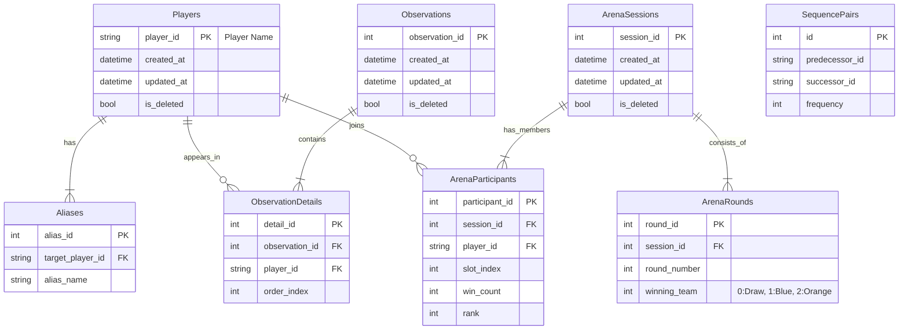

# NSS Player Order Estimation Tool

本ツールは、マッチング時の観測データに基づき、プレイヤーの内部ソート順（Hidden ID）を推定するソフトウェアである。トポロジカルソートおよび強連結成分分解（SCC）を用い、循環参照を含む順序関係の特定を行う。

## Features

* **順序推定**: 相対的な観測データからの絶対順序計算
* **履歴管理**: 入力履歴の表示およびデータベース整合性を維持した取り消し（Undo）機能
* **グラフ可視化**: 推定された順序構造のMermaid記法によるエクスポート
* **設定管理**: GUI上でのデータベース接続先および環境設定（TEST/PROD）の変更

## Download

Windows、macOS、Linux向けのバイナリパッケージはReleasesページより入手可能。

[Download Latest Release](../../releases)

## Build

### Prerequisites

* .NET 9.0 SDK
* MySQL Server (またはRDSへのSSHトンネル接続)

### Linux / macOS

```bash
dotnet build -c Release
dotnet run --project NssOrderTool
```

### Windows

Visual Studio 2022でのソリューションファイル（`NssOrderTool.sln`）のオープン、またはコマンドラインの使用。

```bash
dotnet build -c Release
dotnet run --project NssOrderTool
```

## Usage

### データの登録

1. アプリケーションの起動
2. 入力欄へのプレイヤー名の入力（カンマ区切り。例: `PlayerA, PlayerB, PlayerC`）
3. 登録ボタンの押下による順序更新

### グラフの可視化

推定された順序構造のグラフエクスポート。

1. **Graph** ボタン押下によるグラフ定義のクリップボードへのコピー
2. Mermaid記法対応ビューアへのペーストおよび構造確認

推奨ビューア:
https://mermaid.live/edit

### 設定

**設定 (Settings)** タブでのデータベース接続情報および環境モード（TEST/PROD）の変更（反映にはアプリケーションの再起動が必要）。

---

## データベース設計 (ER図)


